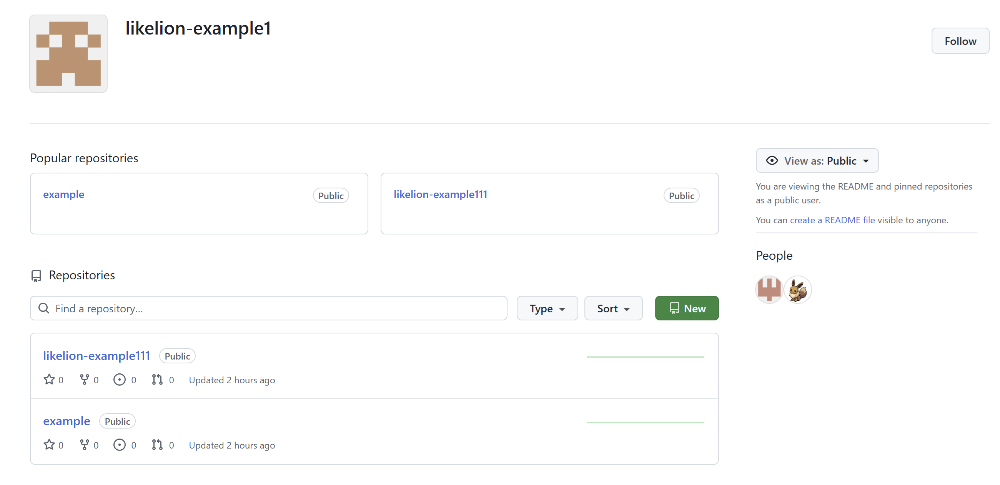
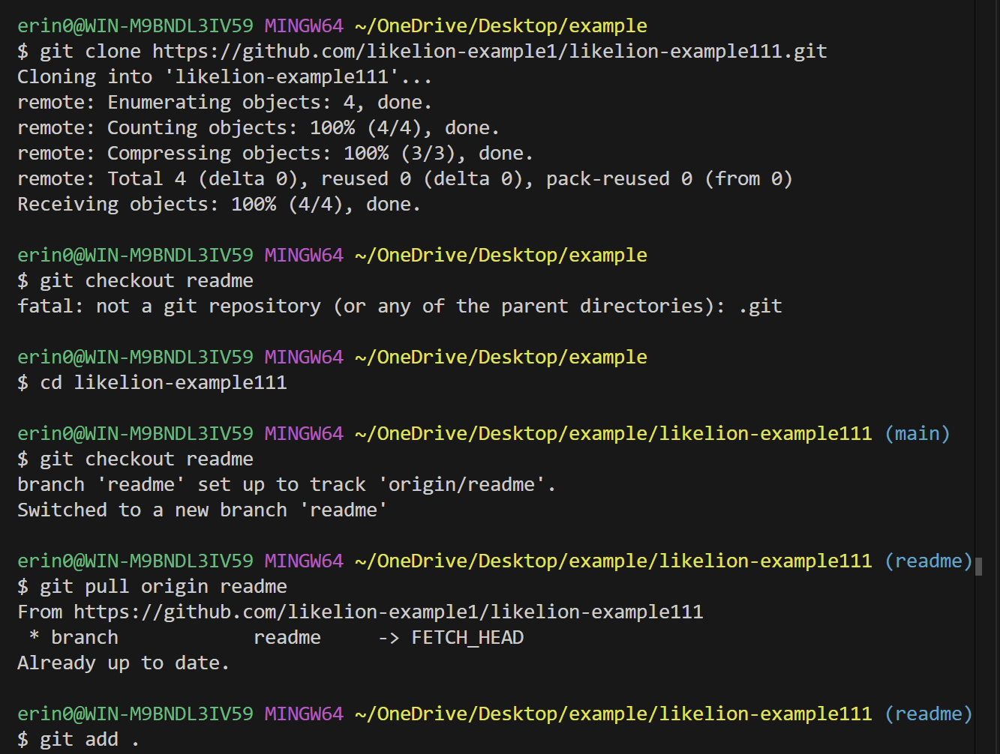
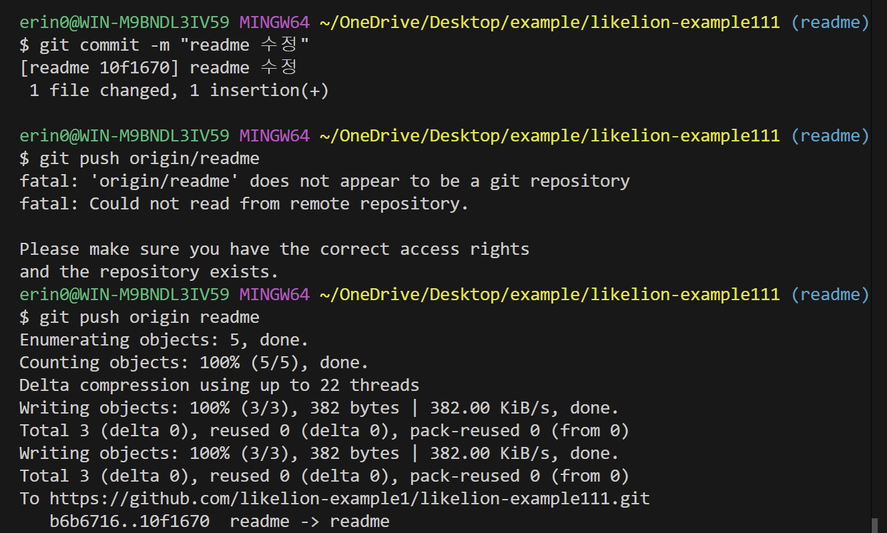
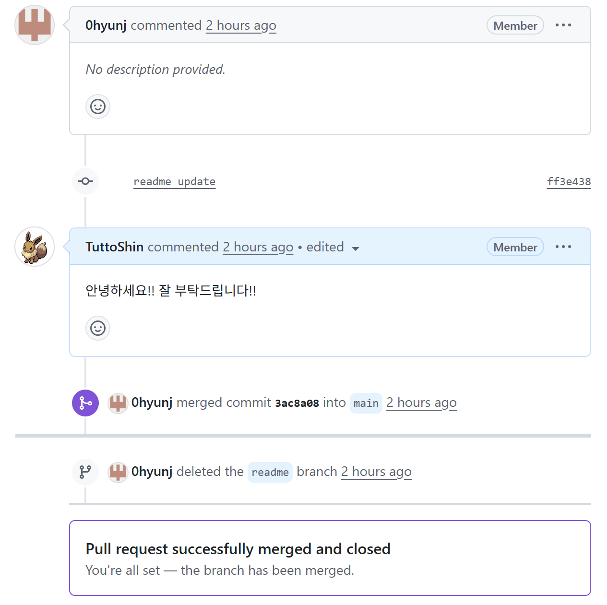

# 14th-TrainingSession-Front
이화여자대학교 멋쟁이사자처럼 14기 프론트엔드 교육 세션
260310 프론트엔드 아기사자 신지민

## 📌 Learning Summary

### *0310 Git & GitHub 기초*
1. Git  
    업계 표준으로 자리 잡은 버전 관리 시스템
- 데이터 플로우 정방향 흐름
    - commit: 변경사항을 하나의 버전으로 기록
    - add: 커밋할 변경사항을 선택
    - .gitignore: 불필요한 파일을 Git 추적에서 제외 (Python은 가능, Java는 불가능...)
- 데이터 플로우 역방향 흐름
    - reset: 차이점을 --soft(스테이징 영역) --mixed (작업 디렉토리) --hard(삭제) 한다.
    - restore: 스테이징 취소, 변경사항 삭제
- BRANCH
    - branch: 소스 코드의 분기점
    - checkout: 다른 브랜치로 전환
    - merge: 변경사항 병합
    - conflict가 뜨면 당황하지 말고, 수동으로 내가 직접 병합하기
- REMOTE REPOSITORY
    - push: 커밋 이력을 로컬 저장소에서 원격 저장소로 업로드 (로컬->원격)
    - pull: 원격 저장소의 커밋 이력을 로컬 저장소에 반영 (원격->로컬)
    - clone: 레포지토리를 로컬로 복제  

2. GitHub  
    Git 호스팅 서비스 중 가장 큰 규모, 개발자들의 SNS
- Organization  
    팀 단위로 프로젝트를 관리할 때 사용
- Pull Request (PR)  
    작업한 브랜치를 가져가 달라고 요청, GitHub의 핵심!
- Fork  
    다른 사람의 저장소를 내 계정으로 복사

3. 꿀팁  
    커밋은 나중에 되돌리기 좋게 작업 단위로, PR은 리뷰하기 좋게 기능 단위로 쪼개자  
    클린 코드를 위해 컨벤션을 정하자  
    프로젝트를 나중에도 기억할 수 있도록 README를 작성하자  

## 🔑 Key

* clone 이후 checkout을 하기 전, cd "레포지토리 이름"을 우선 작성하기 (헤맴)
* checkout 뒤에 쓰는 건 "Branch 이름"이라는 것 잊지 말기
* add 이후에 띄어쓰기 하고 온점 붙이기!
* add - commit - push 로 가는 단계 헷갈리지 말고 기억하기!
* GitHub의 사용 의의는 협업, 코드 공유라는 것 기억하기 (실습에서 백엔드 아기사자님과 각각 레포지토리를 하나씩 만들고 각자 만든 레포지토리에 Pull Request하여 공유가 바로 되지 않는 문제가 발생함)
* Fork 할 때 'copy the main branch only' 선택 해제하기  
(세션이 아니라, 과제 중 배운 것)
* README 파일이 어떻게 보이는지 알고 싶으면, ctrl + Shift + V 단축키 활용하기
* 사진을 README에 넣고 싶으면, 사진 파일을 해당 레포지토리 파일 안에 넣어두자

## 📒 Reference

마크다운 문법 https://www.markdownguide.org/cheat-sheet/

오늘은 구현할 기능이 따로 없어서 참고 문헌이 없으나, 교육 세션 장표에 있던 마크다운 문법을 정독했습니다. 앞으로도 자주 이용해야겠습니다.

## 🔎 Result
* organization + Repositoty 제작

* 로컬 저장소 코드

* review 코멘트 + merge + branch 삭제

## ✍🏻 Review

이론 수업을 들을 때는 다 이해가 되는 것 같더니만, 막상 실습을 시작하니 막히는 곳이 많았습니다. 적응할 때까지는 이번주차 장표를 자주 열어볼 듯합니다. 도움주신 운영진 분들께 감사합니다... (//) 역시 코딩은 직접 손으로 자주 써보고 시행착오를 겪어야 제 것이 되는 것 같습니다. 비주얼 스튜디오 코드와 깃허브가 익숙해질 때까지 파이팅!! 오늘은 프로그램을 다루는 기초만 배웠으나, 시작이 반이라는 말이 있듯이 깃허브에 레포지토리를 만든 흔적이 남으니 뭔가 해낸 것 같아 뿌듯합니다. 앞으로의 교육 세션도 기대됩니다!